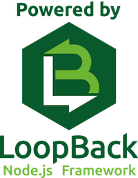

## Appbase: server installation

Appbase server is a [loopback framwork](http://loopback.io) project built to expose a REST API that appbase clients (like [ionic-client](https://github.com/lab-241/appbase-client-ionic)) will consumes.

### Pre requistes

* [Node.js](http://nodejs.org) and [loopback framwork](http://loopback.io) are required on your computer to start this project.

### Dev tools install

When [Node.js](http://nodejs.org) is present on your environment just run following command to install Loopback.

```
$ npm install -g strongloop grunt-cli
```

### Get + start appbase loopback server

```
$ git clone git@git.mikangali.com:lab-241/appbase-server
$ cd appbase-server
$ npm install
$ grunt serve
```

Server is running at : [http://localhost:3000](http://localhost:3000)

### About Loopback framework

Loopback is a opensource Node.js API framework for building REST APIs for your client applications (browser, mobile, etc).



For more about Loopback projects, read official [doc](http://loopback.io/getting-started/)
